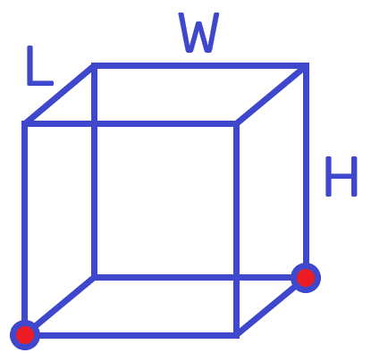
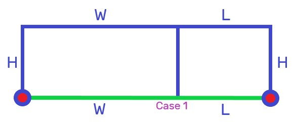
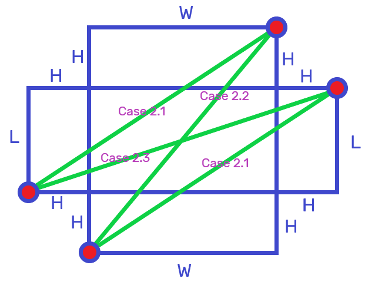

# Ant on Cuboid on Table Problem

A cuboid is glued to a table such that the bottom face of the cuboid is inaccessible. An ant is placed at one vertex of the cuboid which is touching the table. The ant must reach the diagonally opposite vertex which is also touching the table. What is the shortest path the ant can take to reach its destination, given the dimensions of the cuboid $W, L, H$?

When I first approached this problem. I only considered solutions where the ant travels from vertex to vertex without crossing any edges. For some cuboids, the shortest path involves crossing edges.

To make it easier to visualize the paths the ant can take, we can unfold the cuboid into a flat diagram. There are a few different ways of unfolding the cube depending on which faces of the cube are crossed.

If only considering paths which do not cross the top face of the cube (Case 1), then the shortest path is always along the edges touching the table, with path length $=W+L$. Any other path would introduce an unnecessary height increase or decrease, without changing the distance traveled along any other axis.

Paths which do cross the top face of the cube exist within a family of solutions (Case 2), which involve crossing a near top edge and far top edge of the cuboid. These paths don't cross any vertical edges.

Here is a summary of possible cases:
- Case 1: Do not cross top face of cuboid.
	- Shortest path along edges touching table.
	- Path length $=W+L$
- Case 2: Cross top face of cuboid.
	- Cross a near top edge of cuboid, and a far top edge of cuboid.
	- Case 2.1: Cross near top edge of side W/L, and far top edge of side L/W.
		- Path length $=\sqrt{(W+H)^2+(L+H)^2}$
	- Case 2.2: Cross near top edge of side W, and far top edge of side W.
		- Path length $=\sqrt{W^2+(L+2H)^2}$
	- Case 2.3: Cross near top edge of side L, and far top edge of side L.
		- Path length $=\sqrt{(W+2H)^2+L^2}$

To find the shortest path length, calculate the path length for each case and select the case with minimum path length.
